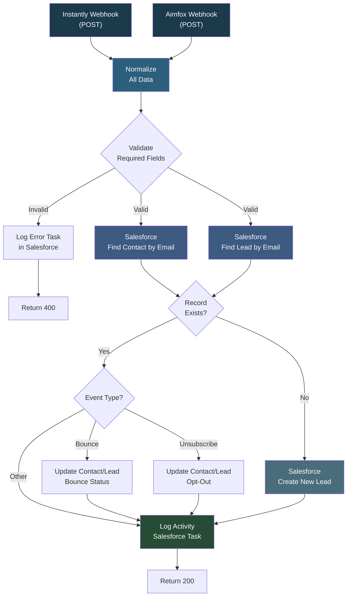

# Instantly Salesforce Aimfox

## Overview

This workflow acts as a central webhook handler that syncs outreach activity from both Instantly (email) and Aimfox (LinkedIn) into Salesforce. When an email is opened, a reply is received, an email bounces, or a lead unsubscribes, the event is logged as a Salesforce task on the matching Contact or Lead record. If the person does not exist in Salesforce yet, a new Lead is created automatically. Bounces and unsubscribes also update the relevant record's description and opt-out status. This keeps your CRM timeline accurate across both email and LinkedIn channels without any manual data entry.

## How It Works

```
Instantly Webhook (POST) or Aimfox Webhook (POST) -> Normalize data -> Validate required fields -> Search Salesforce Contact + Lead by email -> Record exists? -> Route by event type (bounce / unsubscribe / other) -> Update Contact or Lead if needed -> Log Activity as Salesforce Task -> Return 200
```

If the record does not exist, a new Lead is created before logging the activity. If validation fails, an error task is logged and a 400 response is returned.

### Workflow Diagram



## Integrations

- **Instantly** - Email campaign event webhooks (opens, replies, bounces, unsubscribes)
- **Aimfox** - LinkedIn campaign event webhooks
- **Salesforce** - Contact/Lead lookup, creation, updates, and task logging

## Setup

1. Import `instantly_salesforce_aimfox.json` into your n8n instance.
2. Configure Salesforce OAuth2 credentials.
3. Register the webhook URLs in Instantly and Aimfox campaign settings.
4. Activate the workflow.
